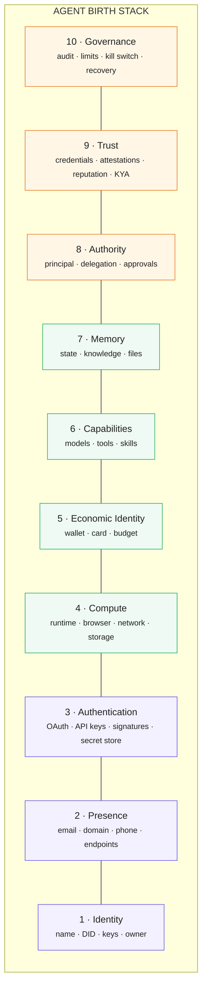

# Agent Birthbook

**The reference architecture for autonomous agent provisioning.**

[](https://matrixa.github.io/agent-birthbook/)
[](LICENSE)
[](CONTRIBUTING.md)
[](https://github.com/MatrixA/agent-birthbook/actions/workflows/links.yml)

> **Agent Birthbook is not another agent identity standard.**
> Identity answers *who an agent is*.
> Birthbook asks *what an agent needs in order to exist and act as an autonomous digital actor.*

A living knowledge base of the identities, accounts, credentials, infrastructure, money, capabilities, permissions and safeguards an autonomous agent needs at birth — organised as a ten-layer **Agent Birth Stack**, with the standards and providers that fill each layer, a provisioning lifecycle, and an experimental machine-readable manifest (`birth.yaml`).

Read it as a book: **[matrixa.github.io/agent-birthbook](https://matrixa.github.io/agent-birthbook/)** · or start at [`docs/README.md`](docs/README.md).

## The Agent Birth Stack



**Existence** (1–3): the agent *is* someone, *can be reached*, and *can prove it*. **Action** (4–7): it has somewhere to run, something to spend, things it can do, and continuity between runs. **Safety** (8–10): its power is bounded, others have a reason to believe it, and a human can see, limit and stop it. Full model: [docs/birth-stack.md](docs/birth-stack.md).

## Contents

- [The Stack, layer by layer](#the-stack-layer-by-layer)
- [Standards & Protocols](#standards--protocols)
- [Birth Providers](#birth-providers)
- [Lifecycle](#lifecycle)
- [Agent Birth Manifest](#agent-birth-manifest)
- [Birth checklist](#birth-checklist)
- [Vocabulary](#vocabulary)
- [Related](#related)
- [Contributing](#contributing)

## The Stack, layer by layer

Each chapter: what the agent needs, minimum vs full provisioning, dependencies, failure modes, the standards and providers that fill the layer, and the matching `birth.yaml` fields.

- [1. Identity](docs/stack/01-identity.md) - Name, DID, signing keys, owner; key custody as the first design decision.
- [2. Presence](docs/stack/02-presence.md) - Email, domain, phone, protocol endpoints; why signup flows make this a bootstrap dependency.
- [3. Authentication](docs/stack/03-authentication.md) - OAuth 2.1, token exchange, API keys, HTTP message signatures, workload identity, and the secret store.
- [4. Compute](docs/stack/04-compute.md) - Sandboxes and runtimes, browsers, egress allowlists, storage.
- [5. Economic Identity](docs/stack/05-economy.md) - Wallets, cards, budgets, payment protocols; the owner passes KYC, not the agent.
- [6. Capabilities](docs/stack/06-capabilities.md) - Model access, tools (MCP, CLI, HTTP), skills, and tool supply-chain risk.
- [7. Memory](docs/stack/07-memory.md) - Working, episodic, semantic, files, knowledge graphs; memory as attack surface.
- [8. Authority](docs/stack/08-authority.md) - Principals, scoped and attenuating delegation, approvals; "has a wallet" ≠ "may spend".
- [9. Trust](docs/stack/09-trust.md) - Verifiable credentials, attestations, reputation, Know-Your-Agent.
- [10. Governance](docs/stack/10-governance.md) - Audit log, limits, kill switch, recovery, review cadence.

## Standards & Protocols

Where each spec sits in the stack, its maturity, and what it competes with. Start with the [standards map](docs/standards/README.md).

- [Identity](docs/standards/identity.md) - W3C DID & VC, A2A Agent Card, ERC-8004, AIMS / Agent Manifest, Agent Passport Standard, HCS-14, Microsoft Entra Agent ID, DIF KYA-OS.
- [Authentication & Delegation](docs/standards/auth-and-delegation.md) - MCP Authorization, OAuth 2.0 Token Exchange (RFC 8693), GNAP, IETF on-behalf-of and transaction-token drafts, SPIFFE, Web Bot Auth / RFC 9421, UCAN, ZCAP.
- [Payments](docs/standards/payments.md) - x402, Google AP2, Visa Trusted Agent Protocol, Mastercard Agent Pay, Stripe Agentic Commerce Protocol & Shared Payment Tokens, PayPal agent toolkit, Skyfire.
- [Discovery](docs/standards/discovery.md) - `/.well-known/agent-card.json`, agents.json, llms.txt, MCP Registry, NANDA.
- [Security & Governance](docs/standards/security-and-governance.md) - OWASP Top 10 for Agentic Applications mapped to the stack, CSA Agentic IAM, NIST CAISI, Know Your Agent, EU AI Act touchpoints.

## Birth Providers

Who actually hands an agent each resource. Every chapter states the interfaces first, then a comparison table (`Provider | Agent-native | OSS | Pricing | Notes`), then links. Read the [provider model](docs/providers/README.md) for how requirement → capability → interface → provider works.

- [Email](docs/providers/email.md) - AgentMail, Resend, Postmark, Mailgun, Fastmail/JMAP, self-hosted.
- [Phone, SMS & Voice](docs/providers/phone.md) - Twilio, Telnyx, Vonage, Plivo, Bland, Vapi; why OTP receipt is the hardest resource.
- [Domains & DNS](docs/providers/domains.md) - Cloudflare Registrar API, Porkbun, Namecheap, ENS; why the agent should live on the owner's domain.
- [Compute & Browsers](docs/providers/compute-and-browsers.md) - E2B, Daytona, Modal, Fly Machines, Vercel Sandbox, Cloudflare Sandbox, Bedrock AgentCore; Browserbase, Steel, Browser Use, Hyperbrowser.
- [Wallets & Keys](docs/providers/wallets.md) - Coinbase CDP / AgentKit, Privy, Turnkey, Crossmint, Lit, Safe, session keys.
- [Payments & Cards](docs/providers/payments-and-cards.md) - Stripe Issuing, Lithic, Ramp, Brex, Mercury, Rain, Payman, Skyfire, Locus, Nevermined.
- [Credentials & Tool Auth](docs/providers/credentials-and-tool-auth.md) - Composio, Arcade, Nango, Pipedream Connect; Auth0 for AI Agents, Okta, WorkOS, Descope, Entra Agent ID; 1Password, Vault, Infisical, Doppler.
- [Memory & Storage](docs/providers/memory-and-storage.md) - Mem0, Zep, Letta, Cognee, LangGraph persistence; Chroma, Qdrant, Pinecone, pgvector; S3, R2.
- [Models & Skills](docs/providers/models-and-skills.md) - OpenRouter, LiteLLM, Portkey, AI gateways; MCP registries; Agent Skills.
- [Observability & Human-in-the-loop](docs/providers/observability-and-hitl.md) - Langfuse, LangSmith, Phoenix, Braintrust, OpenTelemetry GenAI; guardrails; HumanLayer, gotoHuman.
- [Accounts & Legal Entity](docs/providers/accounts-and-legal-entity.md) - GitHub Apps and machine users, Slack and Discord bots, AT Protocol, Farcaster, Nostr; OtoCo, Wyoming DUNA, MIDAO.

## Lifecycle

The **Birth Procedure**: provisioning is not a one-off.

- [Birth](docs/lifecycle/birth.md) - The provisioning sequence and the full ten-layer checklist.
- [Credential Rotation](docs/lifecycle/credential-rotation.md) - Rotation per credential type, overlap windows, leak response.
- [Migration](docs/lifecycle/migration.md) - Moving between compute, model, presence or owner; what is portable and what must be re-attested.
- [Death](docs/lifecycle/death.md) - Suspend vs destroy, wind-down order, what to retain, orphaned agents.

## Agent Birth Manifest

`birth.yaml` is an experimental machine-readable Birth Profile — one section per layer, no secrets, owner mandatory.

- [Walkthrough](docs/manifest.md) - Fields, enumerations, what is deliberately missing.
- [`manifests/schema.json`](manifests/schema.json) - JSON Schema 2020-12.
- [`manifests/examples/research-agent.birth.yaml`](manifests/examples/research-agent.birth.yaml) - A complete example: provider-custodied key, own-domain email, E2B sandbox with an egress allowlist, Coinbase CDP wallet with a 2 USD / 10 USD / 150 USD budget, Slack approvals, Langfuse audit log, owner-held kill switch.

## Birth checklist

The short version. The long version, with three to six items per layer, is in [Birth](docs/lifecycle/birth.md).

- [ ] **Identity** — a named owner, a DID or registry entry, a signing key with a chosen custody model.
- [ ] **Presence** — an email on a domain the owner controls; endpoints published where counterparties look.
- [ ] **Authentication** — a secret store; every credential scoped, referenced not embedded, with a rotation period.
- [ ] **Compute** — an isolated runtime; egress allowlisted; storage separate from the runtime.
- [ ] **Economic Identity** — a wallet or card under policy; hard per-transaction / daily / monthly limits.
- [ ] **Capabilities** — model access through a gateway with a budget; tools from known sources only.
- [ ] **Memory** — stores named, retention set, encrypted at rest.
- [ ] **Authority** — delegations scoped and expiring; actions that need a human listed.
- [ ] **Trust** — owner attestation published; registrations made *after* the kill switch exists.
- [ ] **Governance** — audit log flowing; kill switch tested; recovery path written down; review cadence set.

## Vocabulary

| Term | Meaning |
|---|---|
| **Agent Birthbook** | This knowledge base. |
| **Agent Birth Stack** | The ten-layer model of what an agent must be given. |
| **Agent Birth Manifest (ABM)** | The machine-readable format, `birth.yaml`. |
| **Birth Profile** | One agent's manifest. |
| **Birth Provider** | Anyone who provisions a resource to an agent. |
| **Birth Procedure** | The lifecycle: birth, rotation, migration, death. |

More in the [Glossary](docs/glossary.md).

## Related

Birthbook does not cover agent frameworks, model rankings or MCP server catalogues. [Related Projects](docs/related.md) lists the awesome lists that do, the standards Birthbook sits next to, and the reference-architecture repositories (EU Digital Identity Wallet ARF, Awesome SSI, DIF Universal Resolver) whose method it borrows.

## Contributing

Corrections, new providers, new standards and lifecycle practice are all welcome — see [CONTRIBUTING.md](CONTRIBUTING.md). Entries follow the awesome-list format; every PR runs a link check.

Build the book locally:

```sh
cargo install mdbook mdbook-mermaid
mdbook serve --open
```

The same `docs/` tree also syncs to GitBook via [`.gitbook.yaml`](.gitbook.yaml).

## Roadmap

- Chinese translation (`mdbook-i18n-helpers`).
- Signed, versioned Birth Profiles.
- A provider driver interface and a `birthctl` that provisions from a profile.

## License

[CC0 1.0 Universal](LICENSE). Product names and trademarks belong to their owners.
