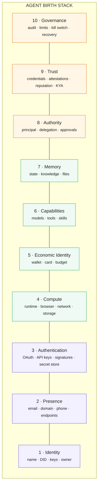
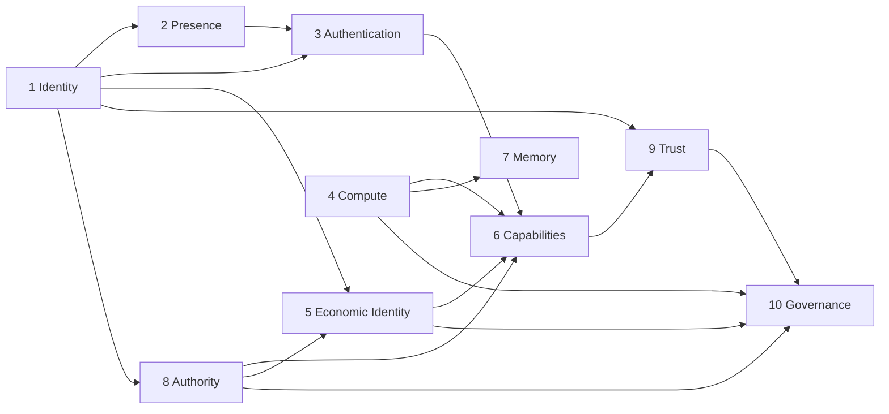
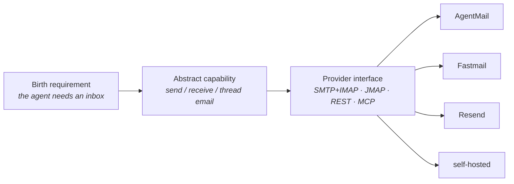
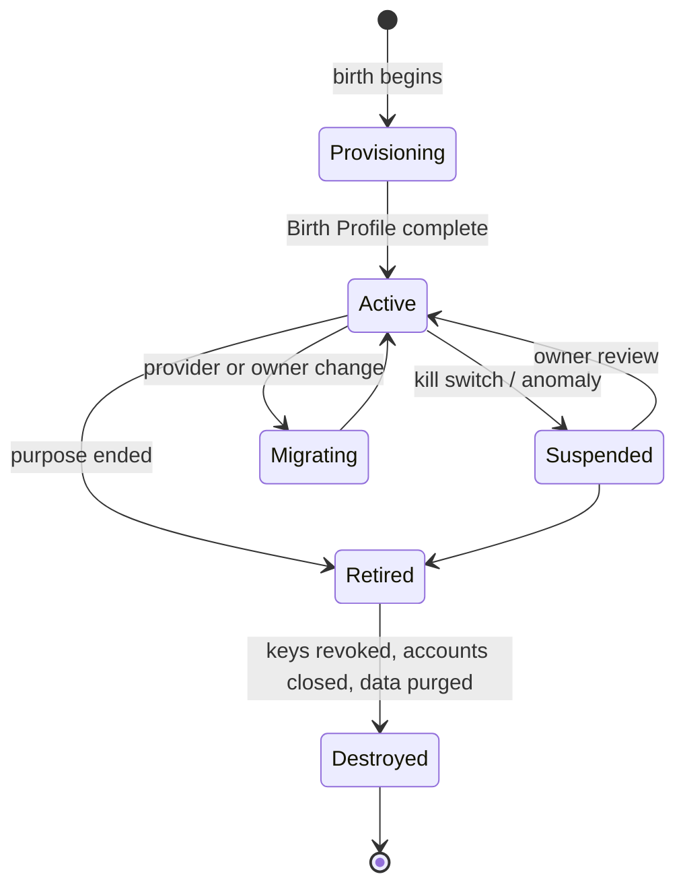

# The Agent Birth Stack

The Birth Stack is the concept model behind this book. It answers one question in ten parts:

> What must an autonomous agent be given in order to exist and act in the digital world?

Each layer is a *kind of thing an agent needs*, not a product or a protocol. Products and protocols live one level down, as [providers](providers/README.md) and [standards](standards/README.md) that satisfy a layer.

Three bands, read bottom-up:

| Band | Layers | What it gives the agent |
|---|---|---|
| **Existence** | 1 Identity · 2 Presence · 3 Authentication | The agent *is* someone, *can be reached*, and *can prove it* to a service. |
| **Action** | 4 Compute · 5 Economic Identity · 6 Capabilities · 7 Memory | The agent has somewhere to run, something to spend, things it can do, and continuity between runs. |
| **Safety** | 8 Authority · 9 Trust · 10 Governance | The agent's power is bounded, others have a reason to believe it, and a human can see, limit, and stop it. |

## The ten layers

| # | Layer | One-line definition | Chapter |
|---|---|---|---|
| 1 | **Identity** | A stable, verifiable answer to *who is this agent and who is responsible for it*: name, identifier (often a DID), signing keys, owner. | [stack/01-identity.md](stack/01-identity.md) |
| 2 | **Presence** | The addresses at which the agent can be found and contacted: email, domain, phone number, protocol endpoints. | [stack/02-presence.md](stack/02-presence.md) |
| 3 | **Authentication** | The credentials the agent presents to *other* systems, and the store that holds them: OAuth grants, API keys, request signatures, workload identity. | [stack/03-authentication.md](stack/03-authentication.md) |
| 4 | **Compute** | Where the agent's code executes and what it can touch: sandbox or VM, browser, network egress, disk. | [stack/04-compute.md](stack/04-compute.md) |
| 5 | **Economic Identity** | The agent's ability to hold and move value: wallets, cards, a budget, and the payment protocols it speaks. | [stack/05-economy.md](stack/05-economy.md) |
| 6 | **Capabilities** | What the agent can actually do: model access, tools (MCP, CLI, HTTP), and packaged skills. | [stack/06-capabilities.md](stack/06-capabilities.md) |
| 7 | **Memory** | What persists between runs: working context, episodic and semantic memory, files, knowledge graphs. | [stack/07-memory.md](stack/07-memory.md) |
| 8 | **Authority** | What the agent is permitted to do, on whose behalf, how far it may delegate, and which actions need a human. | [stack/08-authority.md](stack/08-authority.md) |
| 9 | **Trust** | Why a third party should believe the agent is what it claims: verifiable credentials, attestations, reputation, Know-Your-Agent checks. | [stack/09-trust.md](stack/09-trust.md) |
| 10 | **Governance** | How the owner watches, limits, recovers, and if needed kills the agent: audit log, spend and rate limits, kill switch, recovery path. | [stack/10-governance.md](stack/10-governance.md) |

## Dependencies between layers

The stack is drawn as a column, but the real dependencies form a graph. The important edges:

- **Identity comes first.** Nearly everything else binds to a key or an identifier: an email account has an owner, a wallet has a signer, a delegation has a grantee, a credential has a subject.
- **Presence unlocks Authentication.** Most services still bootstrap accounts through an email address or a phone number. An agent with no inbox cannot finish an OAuth signup.
- **Authority gates Capabilities and Economy.** A tool or a wallet the agent *has* is not a tool or wallet it may *use*. The permission model sits above both.
- **Governance observes everything.** Audit logging, limits, and the kill switch have to reach into compute, money, credentials, and trust registries — which is why it is the top layer and the last one provisioned.

## Minimum viable birth

Not every agent needs all ten layers fully built out. A useful way to think about it:

| Agent type | Layers that must be real | Layers that can be thin |
|---|---|---|
| Internal script that reads and summarises | 1 (a name and owner), 3 (one API key), 4, 6, 10 (a log) | 2, 5, 7, 8, 9 |
| Customer-facing assistant | 1, 2 (an email the customer can reply to), 3, 4, 6, 7, 8, 10 | 5, 9 |
| Agent that spends money | 1, 3, 4, 5, 6, **8 (hard limits)**, **10 (kill switch)** | 2, 7, 9 |
| Agent that transacts with strangers' agents | all ten — this is what the Trust and Governance layers exist for | — |

The [Birth Procedure](lifecycle/birth.md) turns this into a checklist. The [Agent Birth Manifest](manifest.md) turns it into a file.

## From requirement to provider

Every layer is satisfied the same way, which is what makes the stack useful rather than just a taxonomy:

The provider chapters follow this shape: state the requirement, name the interfaces, list the providers. See [Provider model](providers/README.md).

## Lifecycle

An agent's stack is not provisioned once and forgotten. Keys rotate, providers change, owners change, agents are retired.

Each transition has its own chapter under [Lifecycle](lifecycle/birth.md).

## What the stack is not

- **Not a runtime.** Birthbook does not run agents. LangGraph, the Claude Agent SDK, OpenAI Agents, CrewAI and friends sit *inside* layer 6.
- **Not an identity standard.** DIDs, ERC-8004, A2A Agent Cards, AIMS and agent passports are candidate fillers for layers 1 and 9. Birthbook describes where they fit; it does not compete with them.
- **Not a product catalogue.** Providers are listed because someone has to actually hand the agent an inbox or a wallet, but the layer definitions are the durable part; the provider tables will churn.
