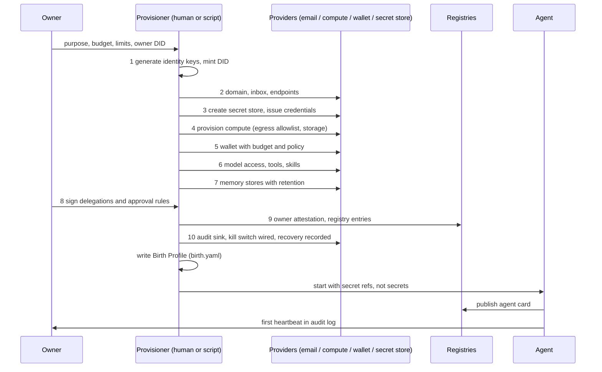

# Birth

The Birth Procedure is the ordered provisioning of the ten layers of the [Agent Birth Stack](../birth-stack.md), ending with a written Birth Profile and a running agent. The order matters more than the tooling: most provisioning mistakes are not wrong providers but right providers in the wrong sequence. This chapter gives the sequence, a checklist per layer, and the manifest that comes out the other end.

## Procedure



### Checklist

**1. Identity** ([layer](../stack/01-identity.md))
- [ ] Owner DID or org handle recorded in `metadata.owner`.
- [ ] Signing key generated with a custody model chosen (`self`, `owner`, `provider`, `tee`, `mpc`); private key never on the agent host unless custody is `self`.
- [ ] DID minted (`did:web` on an owner-controlled domain is the default) and resolvable.
- [ ] Key ID carries a date suffix so rotation is visible.

**2. Presence** ([layer](../stack/02-presence.md))
- [ ] Domain or subdomain under owner control, DNS API access for the provisioner.
- [ ] Inbox created on an agent-native provider; inbound webhooks confirmed.
- [ ] Endpoints reserved (A2A, MCP, HTTPS) even if not yet serving.
- [ ] Phone only if a real use exists; note 10DLC and OTP restrictions.

**3. Authentication** ([layer](../stack/03-authentication.md))
- [ ] Secret store path created; the provisioner writes, the agent reads.
- [ ] Every third-party credential issued with minimum scopes and a `rotation` duration.
- [ ] OAuth grants completed through the agent's own inbox, not the owner's.
- [ ] No secret literal in any file that will be committed or logged.

**4. Compute** ([layer](../stack/04-compute.md))
- [ ] Runtime chosen with isolation level recorded (`microvm` preferred for untrusted input).
- [ ] Egress allowlist written; default deny.
- [ ] Storage bucket created with the agent's own credential.
- [ ] Browser sandbox, if needed, isolated from the runtime.

**5. Economic Identity** ([layer](../stack/05-economy.md))
- [ ] Budget (`perTransaction`, `perDay`, `perMonth`) written before any wallet address exists.
- [ ] Wallet created under a policy engine that enforces that budget at the signer, not in prompt text.
- [ ] Card issued only with spend controls attached.
- [ ] Payment protocols listed; funding kept to one cycle of budget.

**6. Capabilities** ([layer](../stack/06-capabilities.md))
- [ ] Model access via gateway with per-key budget.
- [ ] Tools pinned by source; MCP servers reviewed for scope.
- [ ] Skills listed by name and version.

**7. Memory** ([layer](../stack/07-memory.md))
- [ ] One store per kind, each with a `retention`.
- [ ] Encryption at rest on.
- [ ] Export path tested once before go-live (needed for [migration](migration.md) and [death](death.md)).

**8. Authority** ([layer](../stack/08-authority.md))
- [ ] Principal named.
- [ ] Delegations signed by the owner, scoped narrowly, with `expires` on anything financial.
- [ ] `canSubDelegate` false unless a sub-agent design exists.
- [ ] Approval rules bound to a channel a human actually watches.

**9. Trust** ([layer](../stack/09-trust.md))
- [ ] Owner attestation issued as a verifiable credential and hosted at a stable URL.
- [ ] Registry entries (ERC-8004, agent card) created and linked back to the DID.
- [ ] KYA level recorded if the agent will transact with strangers.

**10. Governance** ([layer](../stack/10-governance.md))
- [ ] Audit sink receiving traces before the first task runs.
- [ ] Kill switch tested: it must revoke credentials, suspend runtime, and freeze wallets from one action.
- [ ] Recovery path written in words a second person can follow.
- [ ] Review cadence set and the first review scheduled.

## Per-layer notes

| Layer | What happens at this stage |
|---|---|
| 1 Identity | Keys and DID created first; everything downstream binds to them. |
| 2 Presence | Domain and inbox exist so OAuth and account signups can complete. |
| 3 Authentication | Secret store created; credentials issued as references. |
| 4 Compute | Runtime built to read from the store; egress narrowed. |
| 5 Economic Identity | Budget defined, then wallet created under policy. |
| 6 Capabilities | Models and tools attached, each behind a credential from layer 3. |
| 7 Memory | Stores provisioned with retention; nothing written yet. |
| 8 Authority | Owner signs delegations and approval rules. |
| 9 Trust | Attestations issued; public registrations made. |
| 10 Governance | Audit and kill switch verified; Birth Profile written; agent starts. |

## Gotchas

- **Compute before secret store.** The runtime gets built with credentials baked into environment files or images. They end up in snapshots and logs, and the first rotation becomes a redeploy. Create the store, then build the runtime to read from it.
- **Wallet before limits.** A funded address with no policy is a full delegation. Write `spec.economy.budget` and the signer policy first; the address is the last thing you create in layer 5.
- **Public registry before kill switch.** Once an ERC-8004 entry or agent card is live, strangers will start talking to the agent. If the kill switch does not exist yet, there is no way to stop that conversation cleanly. Registrations come after governance is wired, not before.
- **Owner's inbox for the agent's OAuth.** Grants end up bound to the human; they break when the human leaves and cannot be rotated independently.
- **Skipping the export test.** Memory that cannot be exported cannot be migrated or purged on schedule.
- **Layers 8 to 10 treated as documentation.** Delegations and limits that live only in a prompt are not enforced. They must sit in the signer, the gateway, and the secret store.

## Output: a Birth Profile

The result is one file, described in [birth.yaml](../manifest.md). Excerpt from the example manifest:

```yaml
spec:
  identity:
    did: did:web:agents.example.com:scout
    keys:
      - id: signing-2026-09
        type: Ed25519
        custody: provider
  authentication:
    secretStore: infisical://prod/agents/scout
  governance:
    killSwitch: { controller: did:web:example.com:people:fernando, mechanism: all }
```

## Related

- [The Agent Birth Stack](../birth-stack.md) for the layer definitions and minimum viable birth table.
- [Credential Rotation](credential-rotation.md), [Migration](migration.md), [Death](death.md) for what happens after birth.
- [Identity standards](../standards/identity.md), [Authentication & Delegation](../standards/auth-and-delegation.md), [Security & Governance](../standards/security-and-governance.md).
- Providers: [Email](../providers/email.md), [Domains & DNS](../providers/domains.md), [Compute & Browsers](../providers/compute-and-browsers.md), [Wallets & Keys](../providers/wallets.md), [Credentials & Tool Auth](../providers/credentials-and-tool-auth.md), [Observability & Human-in-the-loop](../providers/observability-and-hitl.md).
