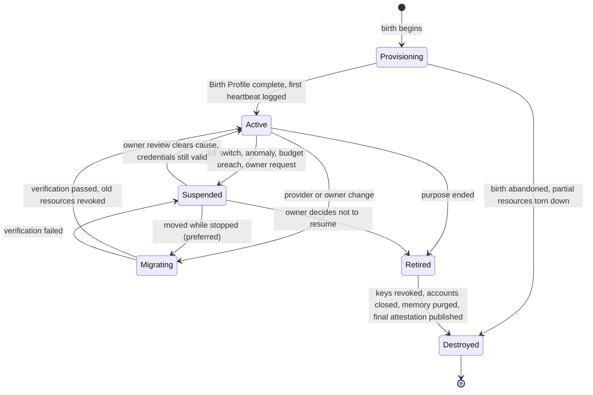

# Death

An agent that can be born must be able to die cleanly. Death is the reverse of the [Birth Procedure](birth.md): the Safety band is used to stop the agent, the Action band is drained and closed, and the Existence band is revoked last so that the record of who the agent was survives the agent. Two states matter most: Suspended, which is reversible and cheap, and Destroyed, which is irreversible and must be earned.

## Procedure

Transition notes:

- **Provisioning to Active** requires all ten layers in the manifest and a kill-switch test. Nothing runs before governance exists.
- **Active to Suspended** is the kill switch firing (`spec.governance.killSwitch.mechanism`). It suspends the runtime, blocks the signer, and disables credentials at the gateway. It does not delete anything. Fast, reversible, and the correct first response to any anomaly.
- **Suspended to Active** is an owner decision recorded in the audit log, after the cause is understood. Credentials that were disabled are re-enabled; credentials that were revoked are re-issued.
- **Active or Suspended to Migrating** is covered in [Migration](migration.md). Migrating from Suspended avoids duplicate actors.
- **Retired** means the agent will not run again but its accounts, wallets and registrations still exist. This is a holding state for wind-down and for the retention clock.
- **Destroyed** is the end. Keys are revoked, accounts closed, data purged. Nothing here can be undone, which is why it is a separate step from Retired.

### Wind-down order (Retired to Destroyed)

1. **Kill switch.** Confirm the agent is stopped and cannot restart. Snapshot the runtime for forensics if the retirement was not planned.
2. **Revoke credentials.** Every entry in `spec.authentication.credentials[]`, at the provider, not just in the store. Delete the secret store path last so the revocation calls still have what they need.
3. **Freeze, then sweep wallets.** Set the signer policy to deny-all, then move funds to the owner's address. Cancel cards. Keep the address on record; counterparties may still send to it.
4. **Close accounts.** Inbox, tool accounts, storage buckets. Set an auto-reply or bounce on the inbox for the retention period before deleting it so that late correspondents learn the agent is gone.
5. **Mark registrations revoked.** Update the DID document with a deactivation, set the ERC-8004 or registry entry to revoked or burn the token, remove the agent card. Do not delete the DID history; others hold signatures that need to verify.
6. **Export, then purge memory.** Export each store in `spec.memory.stores[]` to the owner's archive, then delete per the `retention` on each. Purge is a provider-side deletion with confirmation, not an unlink.
7. **Publish a final attestation.** A signed statement from the owner: agent DID, dates of birth and death, reason, and the hash of the exported audit log. Host it where the owner attestation lived. This is the last thing signed with the agent's identity key before that key is revoked.

## What is retained and what is deleted

| Retain | Delete |
|---|---|
| Audit log for the full retention period; it is the evidence of what the agent did. | Working and episodic memory, unless a retention duration says otherwise. |
| Financial records: wallet addresses, transaction history, card statements. Tax and accounting rules apply to the owner. | Files and semantic stores containing third-party data. |
| The Birth Profile itself, with a `destroyedAt` timestamp added in `metadata`. | All credentials and the secret store path. |
| Public keys and DID document history, so past signatures verify. | Private keys, in every custody model. |
| Final attestation and registry revocation record. | Runtime images and snapshots after forensics are done. |

## Per-layer notes

| Layer | What happens at this stage |
|---|---|
| 1 Identity | DID deactivated; public keys kept; private keys destroyed. |
| 2 Presence | Inbox bounces during retention, then closes; domain stays with owner. |
| 3 Authentication | Credentials revoked at each provider; store path deleted. |
| 4 Compute | Runtime stopped, snapshot for forensics, then deleted. |
| 5 Economic Identity | Signer frozen, funds swept, cards cancelled, records kept. |
| 6 Capabilities | Gateway keys revoked; tool accounts closed. |
| 7 Memory | Exported to owner archive, then purged per retention. |
| 8 Authority | Delegations revoked or allowed to expire; approval channels archived. |
| 9 Trust | Registrations marked revoked; final attestation published. |
| 10 Governance | Audit log frozen and retained; kill switch retired last. |

## Orphaned agents

An agent is orphaned when its owner disappears: a person leaves the company, a company folds, a key is lost, or nobody remembers who set it up. The agent keeps running, keeps spending its budget, and keeps holding credentials, with no one able to review or stop it. This is one of the failure modes OWASP lists under rogue agents ([Security & Governance](../standards/security-and-governance.md)).

The `spec.governance.recovery` field exists for this case. It should name, in plain language, how a second party regains control: who holds the second recovery share, where the kill-switch controller credential is escrowed, and which legal entity owns the agent's accounts. Combined with `spec.governance.reviewCadence`, it gives a mechanical test for orphanhood: an agent that has missed two reviews with no owner response should be suspended by whoever holds the recovery path, then retired if no owner reappears. Delegations with `expires` set provide the same protection from the authority side; an orphaned agent whose delegations lapse becomes an agent that can no longer act, which is the safe default.

## Gotchas

- **Destroying instead of suspending.** Suspension costs nothing and is reversible. Do not skip to Destroyed because an anomaly looked serious.
- **Deleting the secret store before revoking.** The revocation calls fail, and the credentials stay live at the provider with no record of them.
- **Purging memory before exporting.** Retention obligations and the owner's own records are lost.
- **Burning the registry token without a revocation notice.** Counterparties see a missing entry, not a retired agent, and may treat cached data as current.
- **Leaving a funded wallet.** Sweep first. Dust left behind attracts phishing against the owner.
- **No final attestation.** Without a signed end, the agent's identity can be resurrected by anyone who obtains an old key.

## Related

- [Birth](birth.md) for the procedure this reverses.
- [Migration](migration.md) for the Migrating state.
- [Credential Rotation](credential-rotation.md) for revoke-first handling.
- [10. Governance](../stack/10-governance.md), [9. Trust](../stack/09-trust.md), [7. Memory](../stack/07-memory.md), [5. Economic Identity](../stack/05-economy.md).
- [Observability & Human-in-the-loop](../providers/observability-and-hitl.md) for audit sinks, [Accounts & Legal Entity](../providers/accounts-and-legal-entity.md) for who legally owns what the agent leaves behind.
