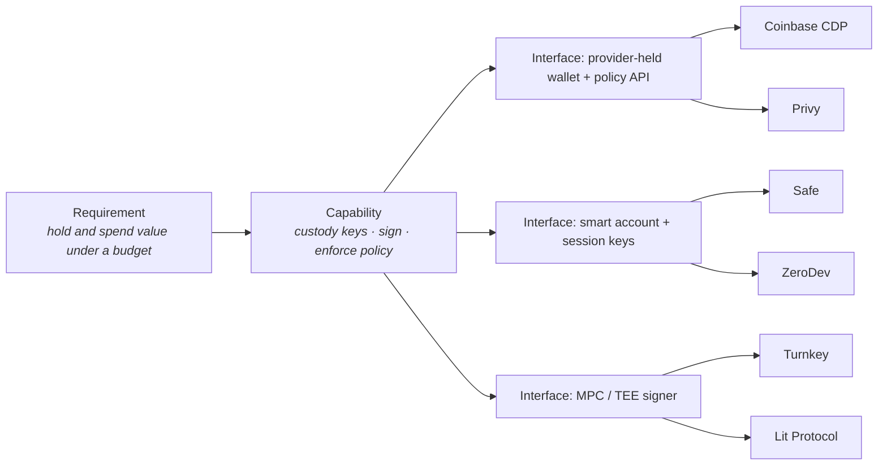

# Provider model

A Birth Provider is any vendor, protocol, or self-hosted component that hands an agent one of the things the [Birth Stack](../birth-stack.md) says it needs: an inbox, a wallet, a sandbox, a secret store. The stack layers are stable; the providers that fill them are not. This section exists so that the churn stays in tables and the reasoning stays in prose.

## Requirement → capability → interface → provider

Every provider chapter follows the same four-step derivation, introduced in [From requirement to provider](../birth-stack.md#from-requirement-to-provider):

1. **Birth requirement** — a sentence from a layer chapter: *the agent needs to hold and spend value under a budget.*
2. **Abstract capability** — the verbs, independent of any vendor: *hold keys, sign transactions, enforce a spend policy, expose balances.*
3. **Provider interface** — the concrete technical surface a provider can expose for those verbs: an SDK with a policy engine, a smart-account module, a raw JSON-RPC signer.
4. **Concrete providers** — the vendors and OSS projects that implement one or more of those interfaces today.

The point of the middle two steps is portability. A Birth Profile that records `spec.economy.wallets[].custody: mpc` and `provider: turnkey` can be migrated to another MPC provider without rewriting the agent; one that hard-codes a vendor SDK cannot. The [Migration](../lifecycle/migration.md) chapter depends on this distinction.

The same shape holds for compute: *the agent needs somewhere to execute untrusted code* → *start, exec, snapshot, destroy an isolated environment* → *microVM API · container API · serverless sandbox SDK* → E2B, Daytona, Modal, Fly Machines, self-hosted Firecracker.

## Reading the tables

Each chapter has one or two tables with a fixed column set:

| Column | Meaning |
|---|---|
| **Provider** | Product or project name, linked to its official site or repository. Nothing else is linked. |
| **Agent-native** | `Yes` — the provider was built for, or has a dedicated product surface for, non-human principals: agent-scoped inboxes, per-agent spend policies, sandboxes that expect to be created and destroyed by code, MCP servers maintained by the vendor. `Usable` — a general-purpose product with an API good enough that an agent can be provisioned onto it, but the account model, ToS, or onboarding still assume a human at the keyboard. |
| **OSS** | `Yes` if the core is open source under an OSI licence and can be self-hosted; `No` otherwise; `Partial` if only SDKs or a reference implementation are open. |
| **Pricing** | One of `Free tier`, `Usage-based`, `Paid`, `OSS + cloud`, `n/a`. No numbers; pricing pages move faster than this book. |
| **Notes** | The one fact that decides whether this provider fits a given Birth Profile: custody model, ToS constraint, region, interface. |

`Agent-native = Yes` is not an endorsement. A `Usable` provider with a mature API is often the better choice; the column tells you how much of the agent-specific work (policy, scoping, lifecycle) the provider does for you and how much you carry yourself in layers [8](../stack/08-authority.md) and [10](../stack/10-governance.md).

## Editorial rule

Links point only to the provider's own site, documentation, or repository, or to a specification or RFC. No blog posts about a provider, no comparison articles, no marketing adjectives ("leading", "seamless", "enterprise-grade") in Notes. If a claim cannot be linked to an official page, it is left out. Pull requests that add a provider must include the official URL and fill every column.

## The eleven provider chapters

- [Email](email.md) - Inboxes an agent can send from, receive into, and complete signups with.
- [Phone, SMS & Voice](phone.md) - Numbers, OTP receipt, A2P messaging, and voice; the hardest resource to obtain honestly.
- [Domains & DNS](domains.md) - Registrar and DNS APIs, `_well-known` and TXT records, and why a subdomain of the owner's domain is the default.
- [Compute & Browsers](compute-and-browsers.md) - Sandboxes and runtimes where agent code executes, and browsers it can drive.
- [Wallets & Keys](wallets.md) - Custody archetypes for on-chain keys: provider-held with policy, MPC/TEE, smart accounts with session keys.
- [Payments & Cards](payments-and-cards.md) - Fiat virtual cards, stablecoin cards, and agent-payment rails; KYC/KYB is always passed by the owner.
- [Credentials & Tool Auth](credentials-and-tool-auth.md) - Token vaults, identity providers with agent features, secret stores, and MCP gateways.
- [Memory & Storage](memory-and-storage.md) - Memory layers, vector stores, object storage, and the markdown-in-git pattern.
- [Models & Skills](models-and-skills.md) - Model gateways with per-key budgets, MCP tool registries, and the Agent Skills format.
- [Observability & Human-in-the-loop](observability-and-hitl.md) - Tracing, guardrails, metering, and human approval channels.
- [Accounts & Legal Entity](accounts-and-legal-entity.md) - Developer-platform accounts, open social protocols, and the legal wrapper that holds the bank account.

## Related

- [The Agent Birth Stack](../birth-stack.md) - Layer definitions the chapters map onto.
- [Standards map](../standards/README.md) - The protocol side of the same graph.
- [Birth](../lifecycle/birth.md) - The procedure that walks the provider chapters in order.
- [birth.yaml](../manifest.md) - Where the chosen providers are recorded.
