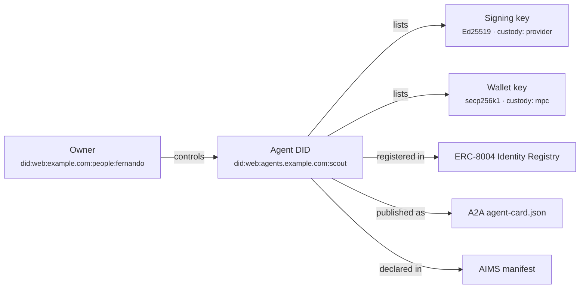

# 1. Identity

Identity gives the agent a stable answer to two questions: *who is this?* and *who is responsible for it?* Concretely that is a name, a resolvable identifier, one or more signing keys, and an owner. Every other layer binds to something in this one: an inbox has an account holder, a wallet has a signer, a delegation has a grantee.

## What the agent needs

Three things get conflated under "identity" and it pays to keep them apart. A **name** (`scout`) is for humans and is not unique. An **identifier** (`did:web:agents.example.com:scout`) is unique and resolvable to a document that lists keys and endpoints. A **key** is what the agent actually uses to prove control of the identifier by signing. A name without an identifier cannot be looked up; an identifier without a key cannot be proven; a key without an identifier is just a random public key with no story attached.

The identifier is usually a [W3C DID](https://www.w3.org/TR/did-core/). Three methods matter in practice. [`did:key`](https://w3c-ccg.github.io/did-key-spec/) encodes the public key itself: zero infrastructure, but no rotation and nothing to resolve beyond the key. [`did:web`](https://w3c-ccg.github.io/did-method-web/) resolves to a JSON document served from a domain the owner controls: rotatable, discoverable, and it ties the agent to a domain that already carries reputation. [`did:pkh`](https://github.com/w3c-ccg/did-pkh) derives a DID from a blockchain address, which is convenient when the agent's wallet *is* its identity. Most agents end up with `did:web` or an on-chain registration such as [ERC-8004](https://eips.ethereum.org/EIPS/eip-8004), plus a key, because those are the two forms other parties can verify without trusting the agent's own word.

The part that is different from human or service identity is the **owner**. An agent is not a legal person; nothing it signs is binding unless a person or company stands behind it. The owner is therefore not metadata but part of the identity: `metadata.owner` is required in the manifest, and the owner is the entity that KYC checks (see [5. Economic Identity](05-economy.md)), that grants delegations (see [8. Authority](08-authority.md)), and that holds the kill switch (see [10. Governance](10-governance.md)). An agent identity with no owner is unverifiable by design.



## Key custody

Where the private key lives decides how autonomous and how recoverable the agent is. `spec.identity.keys[].custody` takes one of five values:

| Custody | Who can sign | Autonomy | Recoverability | Typical use |
|---|---|---|---|---|
| `self` | The agent process on its host | Highest | None: lose the host, lose the key | Ephemeral agents, dev |
| `owner` | The owner's device or vault; agent asks per signature | Lowest | Full | High-value actions, rare signing |
| `provider` | A key service ([Turnkey](https://www.turnkey.com), [Privy](https://privy.io), [Coinbase CDP](https://docs.cdp.coinbase.com/server-wallets/v2/introduction/welcome)) under a policy | High, policy-bounded | Provider recovery flow | Most production agents |
| `tee` | Code inside an enclave; key never leaves | High | Depends on attestation and backup design | Agents that must prove *which code* signed |
| `mpc` | Threshold of shares (agent + owner + provider) | High | Any quorum | Wallets, shared control |

The trade-off is not subtle: the more freely the agent can sign, the harder it is for the owner to recover or revoke. Provider custody with a policy engine is the common middle because revocation is a single API call and the owner never handles raw key material.

## Minimum vs full provisioning

| Aspect | Minimum viable | Full |
|---|---|---|
| Name | `metadata.name` | Name plus reserved handle on relevant registries |
| Identifier | `did:key` | `did:web` on owner's domain, plus ERC-8004 token |
| Keys | One Ed25519 key, `self` custody | Separate signing and wallet keys, `provider`/`mpc` custody, rotation schedule |
| Owner | An email in `metadata.owner` | Owner DID, published owner attestation (see [9. Trust](09-trust.md)) |
| Registrations | None | ERC-8004 entry, A2A agent card, AIMS manifest |

## Depends on / enables

- Depends on nothing; this is the root of the stack.
- Enables [2. Presence](02-presence.md): the `did:web` document and the email domain are usually the same domain.
- Enables [3. Authentication](03-authentication.md): keys sign HTTP requests and client assertions.
- Enables [5. Economic Identity](05-economy.md), [8. Authority](08-authority.md) and [9. Trust](09-trust.md): wallets, delegations and credentials all name the agent DID as subject.

## Failure modes & gotchas

- **Key on the agent host.** A prompt-injected agent with `self` custody can exfiltrate its own key. Anything that signs for money should not be `self`.
- **`did:key` in production.** No rotation means a leaked key is a new identity and every registration has to be redone.
- **Domain expiry.** A `did:web` dies with the domain. Auto-renew, and keep the registrar account under the owner, not the agent (see [Domains & DNS](../providers/domains.md)).
- **Owner is a person who leaves.** Put the owner on a role or legal entity DID, not an employee's personal one; see [Migration](../lifecycle/migration.md).
- **Registration drift.** The ERC-8004 card, the A2A card and the DID document each list keys and endpoints. Generate all three from the manifest or they will disagree.
- **One key for everything.** Use distinct keys for signing statements and for moving funds so that revoking one does not strand the other.

## Standards

- [Identity](../standards/identity.md): W3C DID Core, did:web / did:key / did:pkh, ERC-8004 Trustless Agents, A2A Agent Card, AIMS / Agent Manifest, Agent Passport Standard, HCS-14, Microsoft Entra Agent ID.
- [Discovery](../standards/discovery.md): where the identifier is published so others can find it.
- [Security & Governance](../standards/security-and-governance.md): OWASP ASI03 identity and privilege abuse.

## Providers

- [Wallets & Keys](../providers/wallets.md): Turnkey, Privy, Coinbase CDP, Lit Protocol, Fireblocks for `provider`, `tee` and `mpc` custody.
- [Domains & DNS](../providers/domains.md): the domain behind `did:web`.
- [Accounts & Legal Entity](../providers/accounts-and-legal-entity.md): giving the owner a legal form.

## In the manifest

`metadata.name`, `metadata.owner`, `spec.identity.did`, `spec.identity.keys[]{id,type,custody,publicKey}`, `spec.identity.registrations[]{registry,id,url}`. Private keys never appear; only public keys and custody labels.

```yaml
metadata:
  owner: did:web:example.com:people:fernando
spec:
  identity:
    did: did:web:agents.example.com:scout
    keys:
      - { id: signing-2026-09, type: Ed25519, custody: provider, publicKey: z6Mk... }
    registrations:
      - { registry: erc-8004, id: "8453:1042" }
      - { registry: a2a-agent-card, url: https://agents.example.com/scout/.well-known/agent-card.json }
```
