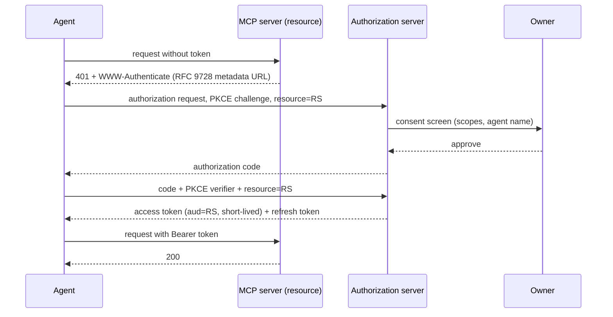

# 3. Authentication

Authentication is the set of credentials the agent presents to other systems, and the store that holds them. Identity is what the agent *is*; authentication is what it *shows* to a GitHub API, an MCP server or a payment gateway to be let in. The two are linked by keys but they are not the same thing, and conflating them is how agents end up with a single long-lived secret standing in for everything.

## What the agent needs

An agent accumulates credentials the way a new employee accumulates badges: an OAuth grant for the owner's calendar, an API key for a model gateway, an installation token for a GitHub App, a signing key for outbound HTTP. Each has a service, a type, a set of scopes, a rotation period, and a location. The manifest models exactly that in `spec.authentication.credentials[]`, and the rule that makes the model safe is simple: **the manifest holds references, never secrets**. `secretRef` points into a store; the store is named in `spec.authentication.secretStore`. Without a secret store the agent's secrets live in environment variables, config files and context windows, all of which a prompt injection can read back.

The dominant protocol is OAuth. The [MCP authorization spec](https://modelcontextprotocol.io/specification/draft/basic/authorization) fixes the shape for agent-to-tool access: [OAuth 2.1](https://datatracker.ietf.org/doc/draft-ietf-oauth-v2-1/) with PKCE mandatory, [RFC 9728](https://www.rfc-editor.org/rfc/rfc9728) Protected Resource Metadata so the client can discover the authorization server from the resource, and [RFC 8707](https://www.rfc-editor.org/rfc/rfc8707) resource indicators so a token minted for one MCP server cannot be replayed against another. The human step is the owner's consent screen; after that the agent holds a short-lived access token and a refresh token that the secret store rotates.



What is specific to agents is the delegation chain. When an agent acts for a user against a downstream API, the downstream API needs to know both *who the subject is* and *who is acting*. [RFC 8693 token exchange](https://www.rfc-editor.org/rfc/rfc8693) does this with the `act` claim: the token says `sub` is the owner and `act` is the agent, and a nested `act` records a sub-agent. Without it, audit logs show the owner doing things the owner never did, and revoking the agent means revoking the owner. The IETF [on-behalf-of draft for AI agents](https://www.ietf.org/archive/id/draft-oauth-ai-agents-on-behalf-of-user-00.html) and the [transaction tokens for agents draft](https://datatracker.ietf.org/doc/draft-oauth-transaction-tokens-for-agents/) extend the same idea; see [8. Authority](08-authority.md) for the policy side.

Two other credential types round out the picture. For outbound requests to sites that have no OAuth relationship with the agent, [RFC 9421 HTTP Message Signatures](https://www.rfc-editor.org/rfc/rfc9421) as used by [Web Bot Auth](https://datatracker.ietf.org/doc/draft-meunier-web-bot-auth-architecture/) let the agent sign each request with a key published from its domain, so a site can tell a named agent from an anonymous scraper. For workload-to-workload calls inside an owner's infrastructure, [SPIFFE](https://spiffe.io/) issues short-lived X.509 or JWT identities per workload with no static secret at all, which is the right fit for the agent's own runtime talking to the owner's internal services.

## Minimum vs full provisioning

| Aspect | Minimum viable | Full |
|---|---|---|
| Secret store | Runtime's native secrets (Fly, Modal, Cloudflare) | Dedicated store (Vault, Infisical, 1Password) with per-agent namespace and access audit |
| OAuth | One grant, manually completed by the owner | MCP-compliant OAuth 2.1 + PKCE + resource indicators, refresh handled by the store |
| API keys | One key, rotated by hand | Per-service keys, `rotation` set, rotated on schedule (see [Credential Rotation](../lifecycle/credential-rotation.md)) |
| Delegation | None; agent uses owner's token | Token exchange with `act` claim per hop |
| Outbound signing | None | RFC 9421 signatures with key in the DID document |
| Workload identity | None | SPIFFE SVIDs for internal calls, mTLS |

## Depends on / enables

- Depends on [1. Identity](01-identity.md): signing keys and the DID document that publishes them.
- Depends on [2. Presence](02-presence.md): email and phone verification during sign-up.
- Enables [6. Capabilities](06-capabilities.md): a tool without a credential is unusable.
- Bounded by [8. Authority](08-authority.md): scopes granted here should never exceed delegations declared there.

## Failure modes & gotchas

- **Secrets in the manifest or repo.** A `birth.yaml` with an API key in it is an incident. Only `secretRef`.
- **Owner's personal token reused.** The agent becomes indistinguishable from the owner in every log; revoking it locks the owner out. Use a separate grant with `act`.
- **Scope creep.** Every OAuth prompt asks for more than needed. Request the minimum and record scopes in the manifest so drift is visible.
- **Long-lived tokens.** A leaked one-year token is a one-year breach. Prefer short access tokens plus refresh in the store; set `rotation` on everything.
- **Token replay across servers.** Without resource indicators, one MCP server can use the token it received against another. Insist on `resource` and audience checks.
- **Secret store with agent-writable policy.** If the agent can grant itself new secrets the store is decoration. Policy changes are an owner action.
- **Dynamic client registration abuse.** MCP clients often register on the fly; make sure the authorization server binds registrations to the agent's identity, not to whoever asks.

## Standards

- [Authentication & Delegation](../standards/auth-and-delegation.md): MCP Authorization, OAuth 2.1, RFC 8707, RFC 9728, RFC 8693 Token Exchange, GNAP (RFC 9635/9767), OAuth on-behalf-of for AI agents, transaction tokens, Web Bot Auth / RFC 9421, SPIFFE and WIMSE.
- [Security & Governance](../standards/security-and-governance.md): OWASP ASI03 identity and privilege abuse, CSA agentic IAM.

## Providers

- [Credentials & Tool Auth](../providers/credentials-and-tool-auth.md): Composio, Arcade, Nango, Pipedream Connect, Auth0 Token Vault, Descope, Keycard; secret stores Vault, Infisical, Doppler, 1Password, Bitwarden Secrets Manager.
- [Accounts & Legal Entity](../providers/accounts-and-legal-entity.md): GitHub Apps, Slack and Discord bot users as first-class machine accounts.

## In the manifest

`spec.authentication.secretStore` and `spec.authentication.credentials[]{service,type,scopes,secretRef,rotation}`. `type` is one of `oauth2 | api-key | jwt | mtls | http-signature | spiffe | other`. `rotation` is an ISO 8601 duration.

```yaml
spec:
  authentication:
    secretStore: infisical://prod/agents/scout
    credentials:
      - { service: github, type: oauth2, scopes: [repo:read, issues:write], secretRef: GITHUB_APP_INSTALLATION, rotation: P1D }
      - { service: web-bot-auth, type: http-signature, secretRef: SIGNING_KEY_2026_09, rotation: P90D }
```
