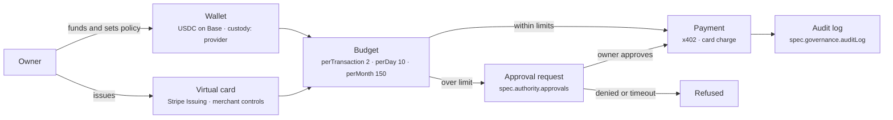

# 5. Economic Identity

Economic Identity is the agent's ability to hold and move value: wallets, cards, a budget, and the payment protocols it speaks. It turns the agent from a consumer of resources the owner pre-paid into something that can buy what it needs, within limits the owner set in advance.

## What the agent needs

Nearly everything an agent does costs money at the point of use: model tokens, sandbox minutes, a search API, a dataset, a domain renewal. Today most of that is billed to the owner's card behind an API key, which works until the agent needs something the owner has no account with, or until three agents share one card and nobody can tell who spent what. An instrument of its own, with its own limits, makes spending attributable and boundable. It is also the precondition for agent-to-agent commerce: an agent that sells a service needs somewhere to be paid.

The instruments come in three shapes. **Crypto wallets** hold stablecoins and pay per request over protocols like x402; settlement is instant and amounts can be cents, but the counterparty must accept crypto. **Fiat cards** work everywhere, but issuers require a legal cardholder, chargebacks and KYC apply, and micropayments are impractical. **Stablecoin-backed cards** ([Rain](https://www.rain.xyz), [Crossmint](https://www.crossmint.com)) bridge the two: the agent holds USDC, the card settles in fiat. Most agents end up with a wallet for machine-to-machine payments and a virtual card for the long tail of SaaS.

Custody matters here more than anywhere else, because a leaked wallet key is an irreversible loss. The same five options from [1. Identity](01-identity.md) apply, and the common answer is **provider-held keys behind a policy engine**: [Coinbase CDP Server Wallets](https://docs.cdp.coinbase.com/server-wallets/v2/introduction/welcome), [Privy](https://privy.io), [Turnkey](https://www.turnkey.com) and [Stripe Issuing for agents](https://docs.stripe.com/issuing/agents) let the owner define what the agent may sign or charge and refuse the rest before it reaches the chain or the network. The agent never sees the key; revocation is one API call.



The budget needs three granularities because they catch different failures. `perTransaction` stops a single absurd purchase. `perDay` stops a loop. `perMonth` is what the owner planned for. Each should be a **hard limit** enforced by the custodian or issuer, not a soft alert the agent is asked to respect; an agent under prompt injection will not respect it, and an alert that arrives after the money is gone is a receipt. Soft alerts still help at 50 and 80 percent so the owner can raise the limit before work stalls. Spending above a hard limit becomes an approval, where [8. Authority](08-authority.md) takes over.

Payment protocols decide who the agent can pay. [x402](https://www.x402.org/) uses HTTP 402 to negotiate a stablecoin payment per request and is the native fit for API access. Google's [AP2](https://ap2-protocol.org/) adds signed intent and cart mandates so a merchant can prove the user authorised a purchase. On the card side, Stripe's [Shared Payment Tokens](https://docs.stripe.com/agentic-commerce/concepts/shared-payment-tokens) and [Agentic Commerce Protocol](https://github.com/agentic-commerce-protocol/agentic-commerce-protocol), [Mastercard Agent Pay](https://www.mastercard.com/us/en/news-and-trends/stories/2025/agent-pay.html) and [Visa's Trusted Agent Protocol](https://usa.visa.com/about-visa/newsroom/press-releases.releaseId.21618.html) tokenise a card for a specific agent and purchase so the merchant can tell an authorised agent from fraud. List what the agent speaks in `spec.economy.paymentProtocols[]`.

Two things the agent cannot do for itself. **KYC/KYB**: no issuer or exchange onboards an agent; the owner or the owner's legal entity passes the checks and the agent's wallet or card is a sub-account under that identity (see [Accounts & Legal Entity](../providers/accounts-and-legal-entity.md)). **Tax and accounting**: every payment the agent makes or receives is the owner's income or expense. Each transaction needs an owner, a purpose and a record, which is why the audit log in [10. Governance](10-governance.md) must receive payment events, not just tool calls.

## Minimum vs full provisioning

| Aspect | Minimum viable | Full |
|---|---|---|
| Wallet | Owner pre-funds API keys; no agent wallet | Provider-custodied stablecoin wallet with policy engine |
| Card | None | Virtual card per agent with merchant and category controls |
| Budget | Provider-side spend cap on one account | `perTransaction`, `perDay`, `perMonth` hard limits plus soft alerts |
| Protocols | None | x402 for APIs, one card-network agent token scheme for commerce |
| Approvals | Owner reviews statement monthly | Over-limit payments routed to an approval channel before execution |
| Accounting | Owner's card statement | Per-agent ledger exported to the owner's books |

## Depends on / enables

- Depends on [1. Identity](01-identity.md): the wallet key is one of the agent's keys, with the same custody choices.
- Gated by [8. Authority](08-authority.md): budgets are the economic form of a delegation; over-limit is an approval.
- Enables [6. Capabilities](06-capabilities.md): paid APIs and compute become usable without the owner pre-registering.
- Observed by [10. Governance](10-governance.md): `freeze-wallet` is a kill-switch mechanism; spend is a governance limit.

## Failure modes & gotchas

- **Wallet key on the agent host.** Irreversible on-chain loss with no chargeback. Use `provider`, `tee` or `mpc` custody for anything funded.
- **Soft limits only.** The model is asked not to overspend; a prompt injection asks it to. Enforce at the custodian.
- **Owner's personal card in the agent's config.** Every agent purchase is now the owner's, and the card number is a secret in plain text.
- **Consumer virtual-card services.** ToS written for individuals; automated use can close the account.
- **Chargebacks.** The issuer may hold the owner liable for agent purchases nobody reviewed. Merchant allowlists on the card reduce the surface.
- **Wrong chain.** A wallet on one chain cannot pay a merchant on another without a bridge, which is another custody risk. Pick the chain your counterparties use.
- **No accounting hand-off.** Six months of x402 micropayments with no ledger is a tax problem for the owner.

## Standards

- [Payments](../standards/payments.md): x402, AP2, Stripe Agentic Commerce Protocol and Shared Payment Tokens, Mastercard Agent Pay, Visa Trusted Agent Protocol, PayPal Agent Toolkit.
- [Identity](../standards/identity.md): ERC-8004, the on-chain identity that wallets and reputation attach to.

## Providers

- [Wallets & Keys](../providers/wallets.md): Coinbase CDP and AgentKit, Privy, Turnkey, Crossmint, Fireblocks, Lit Protocol, Safe, Solana Agent Kit.
- [Payments & Cards](../providers/payments-and-cards.md): Stripe Issuing, Lithic, Ramp, Brex, Mercury, Payman, Skyfire, Locus, Rain, Extend.
- [Accounts & Legal Entity](../providers/accounts-and-legal-entity.md): the entity that passes KYB and owns the bank account.

## In the manifest

`spec.economy.wallets[]{chain,address,custody,provider}`, `spec.economy.cards[]{issuer,last4,controls}`, `spec.economy.budget{currency,perTransaction,perDay,perMonth}`, `spec.economy.paymentProtocols[]`. Addresses and last-four digits are public; keys and full card numbers never appear. Over-limit approvals live in `spec.authority.approvals[]`.

```yaml
spec:
  economy:
    wallets:
      - { chain: base, address: "0x...", custody: provider, provider: coinbase-cdp }
    cards:
      - { issuer: stripe-issuing, last4: "4242", controls: { merchants: [openrouter.ai, e2b.dev] } }
    budget: { currency: USD, perTransaction: 2, perDay: 10, perMonth: 150 }
    paymentProtocols: [x402, stripe-spt]
```
