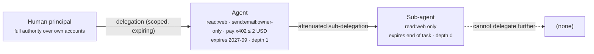

# 8. Authority

Authority is what the agent *may* do, on whose behalf, how far it may pass that permission on, and which actions must stop for a human. It is distinct from every layer below it: a wallet is Economic Identity, a tool is a Capability, a credential is Authentication. None of those is permission. Authority is the permission.

## What the agent needs

**A principal.** Every agent acts for someone: a person, a company, or another agent that itself acts for one of those. The principal is the party whose intent the agent is executing and who is accountable for the result. It is usually but not always the owner in `metadata.owner`; a contractor's agent may be owned by the contractor and act for the client. The manifest separates the two on purpose.

**Delegations that are scoped, expiring, and attenuating.** A delegation is a grant from a principal to the agent: "you may read the web", "you may spend up to 2 USD per x402 call until next September". Three properties make a delegation safe. *Scoped*: it names an action and a bound, not a role. *Expiring*: it has an end date, so a forgotten agent loses power by default. *Attenuating*: anything the agent passes to a sub-agent must be a strict subset of what it holds. The manifest expresses the last with `canSubDelegate` and `maxDelegationDepth`; `depth: 0` means "you may act but never delegate", `depth: 1` means "one hop, and your sub-agents get nothing further".



**Approvals.** Some actions should never be pre-authorised: first payment to a new counterparty, any external email, deleting data, deploying to production. Human-in-the-loop for *named actions* is what `approvals[]` describes: the action pattern, who approves, and the channel where the request appears. This is different from "ask before everything" (which trains the human to click yes) and from "never ask" (which is how agents make the news). Frameworks from [Capabilities](06-capabilities.md) implement the pause; the Birth Profile records the policy.

**Capability-based versus role-based.** Role-based access ("this agent is an *editor*") is what most SaaS and IAM systems offer, and it is how the agent's [credentials](03-authentication.md) are usually issued. Capability-based access (UCAN, ZCAP-LD) instead hands the agent a signed token that *is* the permission, attenuable and delegable offline. Capabilities map naturally onto agent-to-sub-agent chains; roles map onto the systems the agent talks to. In practice you translate: the owner's role in a system is turned into a narrower capability the agent holds. Do not give the agent the owner's role.

## Minimum vs full provisioning

| Aspect | Minimum viable | Full |
|---|---|---|
| Principal | Named in the manifest | A DID or org identifier the counterparty can verify (see [Trust](09-trust.md)) |
| Delegations | Informal ("it has these keys") | Explicit scope + grantedBy + expiry per grant |
| Sub-delegation | Not allowed (`canSubDelegate: false`) | Allowed with `maxDelegationDepth` and attenuation enforced by the runtime |
| Approvals | Human reads the log afterwards | Named actions block on an approver via a defined channel (Slack, email, HITL tool) |
| Enforcement | Prompt instructions | Enforced outside the model: gateway policy, wallet policy engine, tool allowlist |
| Token model | Static API keys inheriting owner's role | Scoped, short-lived tokens (RFC 8693 exchange, txn tokens) or object capabilities |

## Depends on / enables

- Depends on [1. Identity](01-identity.md): a delegation is a signed statement, and the grantee is the agent's key.
- Gates [5. Economic Identity](05-economy.md): the budget is enforced here; the wallet just holds the money.
- Gates [6. Capabilities](06-capabilities.md): the tool list is the possible; delegations are the permitted.
- Feeds [10. Governance](10-governance.md): revoking delegations is one arm of the kill switch, and approvals produce audit entries.

## Failure modes & gotchas

- **"Has a wallet" mistaken for "may spend".** A funded wallet with no policy engine is unlimited authority. Put the limit in the wallet provider's policy or a co-signer, not only in the prompt.
- **Inheriting the owner's role.** An OAuth grant with the owner's full scopes turns the agent into the owner. Ask for the minimum scopes and use token exchange to narrow further per task.
- **Scope creep through convenience.** Each new task adds a permission; none are removed. Expiry dates and a [review cadence](10-governance.md) are the countermeasure.
- **Delegation without attenuation.** A sub-agent that receives the parent's whole token can do everything the parent can. Enforce subset checks in the orchestrator or use capability tokens that make attenuation structural.
- **Approval fatigue.** Too many approval prompts and the human stops reading them. Approve *classes* of action rarely; tune the list.
- **Prompt-only enforcement.** Instructions are advisory; goal hijack ([OWASP ASI01](https://genai.owasp.org/resource/owasp-top-10-for-agentic-applications/)) bypasses them. Authority must be enforced by something the model cannot talk its way past.
- **Confused deputy between agents.** Agent B acting on a request from Agent A must act with A's authority, not its own broader authority. Transaction tokens and `act` claims exist to carry this.

## Standards

- [Authentication & Delegation](../standards/auth-and-delegation.md) - [RFC 8693 Token Exchange](https://www.rfc-editor.org/rfc/rfc8693) (`act` claim for delegation chains); [Transaction Tokens for agents](https://datatracker.ietf.org/doc/draft-oauth-transaction-tokens-for-agents/); [OAuth On-Behalf-Of for AI agents](https://www.ietf.org/archive/id/draft-oauth-ai-agents-on-behalf-of-user-00.html); [RFC 9635 GNAP](https://www.rfc-editor.org/rfc/rfc9635).
- [UCAN](https://github.com/ucan-wg/spec) and [ZCAP-LD](https://w3c-ccg.github.io/zcap-spec/) - object-capability tokens with built-in attenuation and delegation chains.
- [Payments](../standards/payments.md) - AP2 mandates and Visa/Mastercard agent tokens as payment-specific authority grants.
- [Security & Governance](../standards/security-and-governance.md) - OWASP ASI03 identity and privilege abuse; CSA Agentic AI IAM.

## Providers

- [Credentials & Tool Auth](../providers/credentials-and-tool-auth.md) - brokers that issue scoped tokens per tool.
- [Wallets & Keys](../providers/wallets.md) - policy engines and co-signers that enforce spend authority.
- [Observability & Human-in-the-loop](../providers/observability-and-hitl.md) - HumanLayer, gotoHuman and similar for the approvals channel.

## In the manifest

`spec.authority.principal` names who the agent acts for. `spec.authority.delegations[]` carries `scope`, `grantedBy`, `expires`, `canSubDelegate` and `maxDelegationDepth`. `spec.authority.approvals[]` carries `action`, `approver` and `channel`. Scopes are free-form strings today; use a consistent `verb:object:bound` shape so they can be compared.

```yaml
authority:
  principal: did:web:example.com:people:fernando
  delegations:
    - scope: pay:x402:<=2USD
      grantedBy: did:web:example.com:people:fernando
      expires: "2027-09-10T00:00:00Z"
      canSubDelegate: false
      maxDelegationDepth: 0
  approvals:
    - { action: "pay:>2USD", approver: did:web:example.com:people:fernando, channel: "slack:#scout-approvals" }
```
