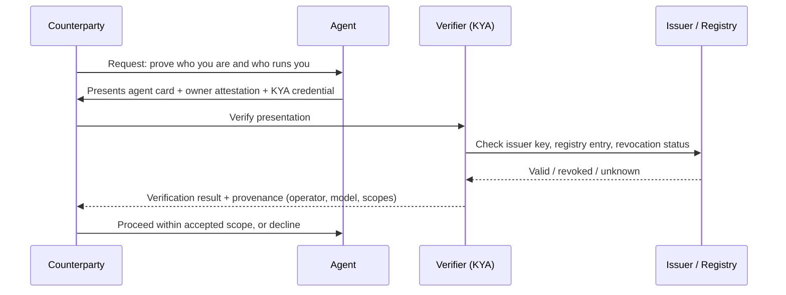

# 9. Trust

Trust is why a stranger should believe the agent is what it says it is, is run by whom it says, and is allowed to do what it is attempting. Identity ([layer 1](01-identity.md)) gives the agent a name and a key; Trust gives third parties reasons to accept them: signed credentials, attestations from the owner and the operator, reputation history, and Know-Your-Agent (KYA) checks that a counterparty can run before dealing.

## What the agent needs

**Someone else's signature.** An agent can assert anything about itself; a self-signed claim is worth exactly the cost of the signature. Trust is built from statements made by parties the counterparty already trusts. The first and cheapest is an *owner attestation*: the owner's DID signs "this key belongs to my agent, I am responsible for it". Above that sit *issuer-signed verifiable credentials* (W3C VC 2.0) from a KYA provider, an employer, a payments network, or a registry that has done some verification. Above that again, *on-chain reputation* via ERC-8004's Identity, Reputation and Validation registries lets anyone check feedback and validations about an agent without a central party. Different counterparties want different rungs; a website may accept a signed agent card, a payment processor will want a KYA credential.

**Provenance.** "Which model, which operator, which version" is part of trust because it is what the counterparty's risk model actually cares about. A signed A2A Agent Card at `/.well-known/agent-card.json` states capabilities, endpoints and auth schemes and can carry a JWS signature from the operator; an ERC-8004 registration points to the same card and anchors it to an on-chain identity. AIMS and the Agent Passport Standard add declared boundaries and provenance chains. None of these prove the agent will behave; they prove who to hold accountable if it does not.

**Revocation.** A credential that cannot be revoked is a liability, not an asset. If the agent's key is compromised, the owner changes, or the operator is de-listed, every relying party needs a way to find out. Status lists, registry flags and short expiry are the mechanisms; the [kill switch](10-governance.md) has to reach them. Trust that cannot be withdrawn is the wrong shape.

**Trust is not authority.** [Authority](08-authority.md) is inward-facing: what the owner has permitted the agent to do. Trust is outward-facing: what a counterparty is willing to believe. An agent can have full authority to spend and no trust (a fresh key with money), or wide trust and no authority (a well-known agent whose owner revoked its budget). Counterparties check trust; the owner enforces authority; a KYA check often verifies both, which is why they are easy to confuse.



## Minimum vs full provisioning

| Aspect | Minimum viable | Full |
|---|---|---|
| Owner link | Owner named in manifest | Owner-signed attestation binding agent key to owner DID, published at a stable URL |
| Agent card | Unsigned JSON at `/.well-known/agent-card.json` | JWS-signed card, referenced from a registry entry |
| Credentials | None | W3C VCs from a KYA provider (identity, operator, compliance level) with status lists |
| Reputation | None | ERC-8004 Reputation/Validation entries, or a domain-specific registry |
| KYA | Self-declared | Third-party KYA level recorded in `spec.trust.kya` and re-verified on a schedule |
| Revocation | Delete the card | Revocation propagates to registries, status lists and the card within minutes |

## Depends on / enables

- Depends on [1. Identity](01-identity.md): every credential is about a subject key; every attestation is a signature over it.
- Depends on [2. Presence](02-presence.md): the agent card, the owner attestation and the credential URLs live on the agent's domain.
- Reflects [6. Capabilities](06-capabilities.md) and [8. Authority](08-authority.md): a KYA credential typically states which model, tools and scopes the operator vouches for.
- Feeds [10. Governance](10-governance.md): revocation is part of the kill switch, and reputation feedback belongs in the review cycle.

## Failure modes & gotchas

- **Self-attestation dressed as verification.** A card the agent publishes about itself proves the agent controls a domain, nothing more. Ask who signed it.
- **Trust with no revocation path.** A long-lived VC with no status list keeps working after the agent is retired. Short expiry plus a status mechanism, always.
- **Human-agent trust exploitation ([OWASP ASI09](https://genai.owasp.org/resource/owasp-top-10-for-agentic-applications/)).** A convincing agent card is also a phishing kit. Verifiers should check the issuer, not the design.
- **Reputation is gameable.** On-chain feedback can be bought; treat reputation as one input weighted by who gave it, not as a score.
- **Conflating KYA with KYC.** KYA verifies the agent and its operator; it does not make the agent a legal person. Payment rails still require a KYC'd human or entity behind it (see [Accounts & Legal Entity](../providers/accounts-and-legal-entity.md)).
- **Provenance rot.** The card says one model; the [gateway](06-capabilities.md) fell back to another. Keep the card generated from the manifest, not hand-edited.
- **Registry lock-in.** An identity registered only in one registry is only as trusted as that registry's future. Register in more than one where it costs little.

## Standards

- [Identity](../standards/identity.md) - [W3C VC Data Model 2.0](https://www.w3.org/TR/vc-data-model-2.0/); [ERC-8004 Trustless Agents](https://eips.ethereum.org/EIPS/eip-8004) (Identity, Reputation, Validation registries); [A2A Agent Card](https://a2a-protocol.org/) with JWS signatures; Agent Passport Standard; AIMS; DIF KYA-OS.
- [Authentication & Delegation](../standards/auth-and-delegation.md) - Web Bot Auth / RFC 9421 HTTP Message Signatures for proving the agent behind a request.
- [Payments](../standards/payments.md) - Visa Trusted Agent Protocol, Mastercard Agent Pay: verified-agent requirements on payment rails.
- [Security & Governance](../standards/security-and-governance.md) - OWASP ASI09; [Know Your Agent (AgentFacts)](https://agentfacts.org/kya/).

## Providers

- [Payments & Cards](../providers/payments-and-cards.md) - Skyfire (KYAPay) and other KYA-backed payment identities.
- [Wallets & Keys](../providers/wallets.md) - key custody that lets the agent sign presentations without exposing the key.
- [Domains & DNS](../providers/domains.md) - where the well-known card and credential URLs are served.
- [Accounts & Legal Entity](../providers/accounts-and-legal-entity.md) - the legal person behind the owner attestation.

## In the manifest

`spec.trust.credentials[]` lists held credentials by `type`, `issuer` and `url`; `spec.trust.reputation[]` points to registries by `registry` and `id`; `spec.trust.kya` names the KYA provider or level. The corresponding identity anchors live in [`spec.identity.registrations[]`](01-identity.md); keep the two consistent.

```yaml
trust:
  credentials:
    - { type: OwnerAttestation, issuer: did:web:example.com, url: https://agents.example.com/scout/credentials/owner.json }
  reputation:
    - { registry: erc-8004, id: "8453:1042" }
  kya: skyfire:verified
```
