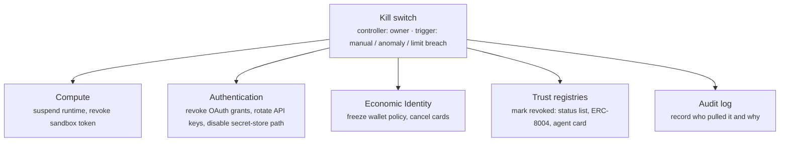

# 10. Governance

Governance is how the owner watches, limits, recovers and, if necessary, stops the agent. It is the top layer because it has to reach into all the others: the audit log records what Capabilities did, the limits cap Economic Identity and Compute, the kill switch revokes Authentication and Authority and marks Trust registries, and recovery restores Identity. It is the last layer provisioned.

## What the agent needs

**An audit log, non-negotiable.** Every model call, tool call, payment, credential use and approval decision goes to a store the agent cannot edit. This is the one governance control that applies even to the smallest internal script (see [Minimum viable birth](../birth-stack.md#minimum-viable-birth)). The practical shape is a trace: OpenTelemetry's GenAI semantic conventions define spans for model and agent operations, and tracing products (Langfuse, LangSmith, Arize Phoenix, Braintrust) consume them. An agent's [memory](07-memory.md) is writable by the agent, so it is not evidence. The log is.

**Limits.** Four kinds, all enforced outside the model. *Spend*: per-transaction, per-day, per-month, enforced by the wallet or card provider ([Economic Identity](05-economy.md)). *Rate*: calls per minute to models and tools, enforced at the gateway. *Runtime*: hours per day, enforced by the [Compute](04-compute.md) scheduler. *Blast radius*: which systems the agent can touch at all, enforced by network egress allowlists and tool allowlists ([Capabilities](06-capabilities.md)). A limit the model is asked to respect is a suggestion.

**A kill switch, and someone who holds it.** Stopping an agent is not one action; it is four, and a partial stop leaves a running process with money, or a dead process with live credentials. The controller must be a named party (the owner, an on-call role, or a governance service) with pre-provisioned access to each arm, and the switch must work when the agent's own infrastructure is compromised, which means it cannot run on the agent's runtime.



**Recovery.** Three losses to plan for. *Lost keys*: the agent's signing key is gone or compromised; recovery means a rotation path where a new key is bound to the same identity by the owner ([Identity](01-identity.md), [Credential Rotation](../lifecycle/credential-rotation.md)). *Lost owner*: the person leaves, dies, or the company folds; recovery means a documented successor and a second custody share. *Provider outage*: the runtime, gateway or memory provider is down or gone; recovery means exports exist and the [Migration](../lifecycle/migration.md) procedure has been rehearsed.

**Review cadence.** Delegations accumulate, limits drift, credentials outlive their reason. A recurring human review of the whole Birth Profile against what the agent actually did is how scope creep gets reversed. Monthly is a reasonable default for an agent that spends money; quarterly for one that only reads.

## Minimum vs full provisioning

| Aspect | Minimum viable | Full |
|---|---|---|
| Audit log | Append-only file the agent cannot write to | OTel GenAI traces to a hosted tracing system, retention set, tamper-evident |
| Limits | Budget cap at the model gateway | Spend + rate + runtime + blast-radius limits, each enforced at its own layer |
| Kill switch | Owner can revoke the API key | Single control reaching compute, credentials, wallet and registries; tested quarterly |
| Recovery | Owner has a backup of the manifest | Documented key rotation, successor owner, second custody share, rehearsed migration |
| Review | When something goes wrong | `reviewCadence` on the calendar, with the log and the manifest side by side |
| Anomaly detection | None | Alerts on spend spikes, unusual tools, failed approvals, new counterparties |

## Depends on / enables

- Depends on every layer having a control point: [3. Authentication](03-authentication.md) (revocable credentials), [4. Compute](04-compute.md) (suspendable runtime), [5. Economic Identity](05-economy.md) (policy-enforced wallet), [8. Authority](08-authority.md) (revocable delegations), [9. Trust](09-trust.md) (revocable credentials and registry flags).
- Enables the [lifecycle](../lifecycle/death.md): Suspended, Retired and Destroyed are governance actions.
- Makes [Trust](09-trust.md) credible: a counterparty's KYA check is stronger when the operator can show governance is in place.

## Failure modes & gotchas

- **Kill switch on the agent's own infrastructure.** If the switch is a tool the agent calls, a hijacked agent will not call it. Hold it outside.
- **Partial kill.** Runtime suspended, credentials still valid; a copy resumes elsewhere. Rogue-agent scenarios ([OWASP ASI10](https://genai.owasp.org/resource/owasp-top-10-for-agentic-applications/)) are mostly incomplete kills.
- **Log the agent can edit.** Traces written to the agent's own storage are memory, not audit. Ship them out.
- **Single owner, single key, single share.** Recovery that depends on one person's laptop is not recovery. Two shares, two people.
- **Cascading failures (ASI08).** One agent's kill triggers retries in others. Coordinate limits across a fleet; the kill switch should be able to stop dependants too.
- **Personal data in traces.** The audit log often contains more personal data than memory does. Apply retention and access control to it as well.

## Standards

- [Security & Governance](../standards/security-and-governance.md) - OWASP Top 10 for Agentic Applications (ASI08, ASI10); [OpenTelemetry GenAI semantic conventions](https://github.com/open-telemetry/semantic-conventions-genai); NIST and CSA guidance.
- Regulatory touchpoints, kept brief: [EU AI Act Article 12](https://artificialintelligenceact.eu/article/12/) requires high-risk systems to automatically record events over their lifetime; [NIST AI 800-4](https://doi.org/10.6028/NIST.AI.800-4) catalogues post-deployment monitoring challenges and expects a "monitorability tax"; Singapore's [IMDA Model AI Governance Framework for Agentic AI](https://www.imda.gov.sg/-/media/imda/files/about/emerging-tech-and-research/artificial-intelligence/mgf-for-agentic-ai.pdf) sets out levels of human involvement and agent boundaries. None mandate a specific mechanism; all assume a log and a stop button exist.
- [Authentication & Delegation](../standards/auth-and-delegation.md) - revocation semantics of OAuth grants and short-lived tokens.

## Providers

- [Observability & Human-in-the-loop](../providers/observability-and-hitl.md) - Langfuse, LangSmith, Arize Phoenix, Braintrust, AgentOps; OpenMeter for metering; HumanLayer and gotoHuman for approvals; guardrail products.
- [Models & Skills](../providers/models-and-skills.md) - gateways with per-key budgets and rate limits.
- [Wallets & Keys](../providers/wallets.md) and [Payments & Cards](../providers/payments-and-cards.md) - policy engines, freeze and cancel controls.
- [Compute & Browsers](../providers/compute-and-browsers.md) - runtimes that can be suspended and time-boxed.

## In the manifest

`spec.governance.auditLog` names where traces go; `spec.governance.killSwitch` names the `controller` and the `mechanism` (`revoke-keys | suspend-runtime | freeze-wallet | all`); `spec.governance.limits` is free-form for anything not already in [`spec.economy.budget`](05-economy.md); `spec.governance.recovery` describes how control is regained; `spec.governance.reviewCadence` is an ISO 8601 duration.

```yaml
governance:
  auditLog: langfuse://project/scout
  killSwitch: { controller: did:web:example.com:people:fernando, mechanism: all }
  limits: { maxRuntimeHoursPerDay: 8, maxEmailsPerDay: 5 }
  recovery: Owner holds provider recovery share; second share in company password vault.
  reviewCadence: P30D
```
