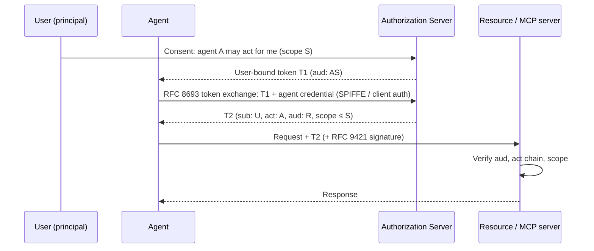

# Authentication & delegation standards

Layer 3 is about the credentials an agent presents to other systems; layer 8 is about whether it was allowed to. The standards here cover both ends: how an agent obtains a token for a resource (MCP Authorization, OAuth 2.1, GNAP), how a token can say *this agent acts for that user* (RFC 8693 Token Exchange, the on-behalf-of and transaction-token drafts), how a workload proves what it is without a user at all (SPIFFE, WIMSE, Web Bot Auth), and the capability-based alternative where the authorization *is* the credential (UCAN, ZCAP). Nearly everything is OAuth-shaped; the open question is how to express a chain human → agent → sub-agent → tool in a way resource servers can verify.

## At a glance

| Standard | Layer | Maturity | Backed by | Link |
|---|---|---|---|---|
| MCP Authorization (OAuth 2.1 + RFC 9728 + RFC 8707) | 3 Authentication | Adopted | MCP project (Anthropic-originated) | [modelcontextprotocol.io](https://modelcontextprotocol.io/specification/2025-06-18/basic/authorization) |
| RFC 8693 OAuth 2.0 Token Exchange | 3, 8 | Adopted | IETF | [rfc8693](https://www.rfc-editor.org/rfc/rfc8693) |
| RFC 9635 GNAP / RFC 9767 GNAP Resource Servers | 3, 8 | Adopted | IETF | [rfc9635](https://www.rfc-editor.org/rfc/rfc9635) · [rfc9767](https://www.rfc-editor.org/rfc/rfc9767) |
| OAuth On-Behalf-Of User Authorization for AI Agents | 8 Authority | Draft (expired individual) | individual | [datatracker](https://datatracker.ietf.org/doc/draft-oauth-ai-agents-on-behalf-of-user/) |
| Transaction Tokens / Transaction Tokens for Agents | 3, 8 | Draft | IETF OAuth WG / individual | [txn-tokens](https://datatracker.ietf.org/doc/draft-ietf-oauth-transaction-tokens/) · [for agents](https://datatracker.ietf.org/doc/draft-araut-oauth-transaction-tokens-for-agents/) |
| draft-klrc-aiagent-auth | 3, 8 | Draft (WIMSE WG adopted) | IETF WIMSE | [datatracker](https://datatracker.ietf.org/doc/draft-klrc-aiagent-auth/) |
| draft-liu-ai-agent-authorization-integration | 8 Authority | Draft (individual) | individual | [datatracker](https://datatracker.ietf.org/doc/draft-liu-ai-agent-authorization-integration/) |
| IETF WIMSE WG | 3 Authentication | Draft | IETF | [datatracker.ietf.org/wg/wimse](https://datatracker.ietf.org/wg/wimse/about/) |
| SPIFFE / SPIRE | 3 Authentication | Production | CNCF | [spiffe.io](https://spiffe.io/) |
| Web Bot Auth + RFC 9421 HTTP Message Signatures | 3 Authentication | Draft (WG) / Adopted (9421) | IETF webbotauth WG; Cloudflare | [draft](https://datatracker.ietf.org/doc/draft-meunier-web-bot-auth-architecture/) · [rfc9421](https://www.rfc-editor.org/rfc/rfc9421) |
| UCAN 1.0 | 8 Authority | Adopted | UCAN WG | [github.com/ucan-wg/spec](https://github.com/ucan-wg/spec) |
| ZCAP (Authorization Capabilities) | 8 Authority | Draft | W3C CCG | [w3c-ccg.github.io/zcap-spec](https://w3c-ccg.github.io/zcap-spec/) |
| OpenID AI Identity Management CG | 3, 8 | Draft | OpenID Foundation | [openid.net/cg](https://openid.net/cg/artificial-intelligence-identity-management-community-group/) |

## Notes per standard

### MCP Authorization
Profiles OAuth 2.1 for HTTP-transport MCP servers: the server is a resource server, publishes RFC 9728 Protected Resource Metadata, and the client must send an RFC 8707 `resource` indicator so tokens are audience-bound. Dynamic client registration (RFC 7591) is recommended because an agent cannot pre-register with every server. It explicitly forbids token passthrough and says nothing about delegation chains; each MCP server is its own OAuth client to upstream APIs. This is the default for [Capabilities](../stack/06-capabilities.md) tool auth.

### RFC 8693 Token Exchange
Lets a party trade one token for another at the authorization server, producing a token whose `act` claim records the chain of actors (delegation) or which simply impersonates the subject. It is the only *adopted* RFC that can express "agent A, acting for user U, calling resource R". It does not define how the agent got the first token or how deep the chain may go.

### GNAP (RFC 9635 / 9767)
Grant Negotiation and Authorization Protocol: a from-scratch successor to OAuth with key-bound requests, multi-resource grants, and interaction modes that do not assume a browser. RFC 9767 covers the resource-server side. Better fit for headless agents than OAuth 2.1, but almost no deployments. Watch for agent-specific profiles.

### On-Behalf-Of for AI agents (draft)
Adds a `requested_agent` parameter and an agent authorization-code flow so the user consents to a *named agent* acting for them, and the resulting token names both. Individual draft, expired 2025; the ideas continue in the WIMSE and OpenID CG work. Useful as vocabulary for `spec.authority.delegations[]`.

### Transaction Tokens (+ for agents)
Short-lived, signed JWTs minted at the edge that carry request context through a call chain of internal services. The for-agents draft adds agent identity and human-purpose claims so each hop can check who started the transaction. Draft; the base document is an OAuth WG item, the agent extension is individual.

### draft-klrc-aiagent-auth
Best-current-practice text, now adopted by the WIMSE WG, on combining workload identity (agent as workload) with OAuth (agent as delegate) and on where to bind human intent. The most likely home for an eventual IETF consensus on agent auth.

### draft-liu-ai-agent-authorization-integration
Individual informational draft describing how agent frameworks should integrate with external authorization services (policy decision points) rather than reimplement checks in prompts. Read it alongside [Governance](../stack/10-governance.md).

### WIMSE WG
Workload Identity in Multi System Environments: IETF working group standardising how workloads (containers, functions, and now agents) prove identity across trust domains, including token formats and proof of possession. Agent-specific work is converging here.

### SPIFFE / SPIRE
CNCF standard for issuing short-lived X.509 or JWT SVIDs to workloads based on attested runtime properties. Solves "which process is this" for [Compute](../stack/04-compute.md); does not solve "on whose behalf". Map to `spec.authentication.credentials[].type: spiffe`.

### Web Bot Auth + RFC 9421
RFC 9421 defines signing HTTP messages. Web Bot Auth (now an IETF working group, originated at Cloudflare) profiles it so a bot signs requests with a key published in a directory, letting sites verify the operator rather than trusting a user-agent string. Also the verification layer under Visa Trusted Agent Protocol and Mastercard Agent Pay acceptance ([Payments](payments.md)). Map to `type: http-signature`.

### UCAN and ZCAP
Object-capability tokens: the bearer holds a signed chain proving that the root owner delegated a capability, attenuated at each hop, with no authorization server in the loop. UCAN 1.0 (DID-keyed, IPLD/JWT encodings) and ZCAP (W3C CCG, Data Integrity proofs) are the two live designs. They are the cleanest fit for `canSubDelegate` and `maxDelegationDepth` in `spec.authority.delegations[]`, but resource servers must understand them, which most SaaS APIs do not.

### OpenID AI Identity Management CG
OpenID Foundation community group collecting agent identity requirements and drafting OpenID Connect / OAuth profiles for agents. Draft; no published spec yet.

## How they fit together

Layer 3 lives at the bottom of the diagram (agent credential, signatures); layer 8 lives at the top (consent, `act` chain, scope narrowing). OAuth 2.1 via MCP handles the common case of one agent and one tool. Token Exchange or transaction tokens add the chain. UCAN/ZCAP remove the authorization server entirely, which is attractive for agent-to-agent calls where no shared IdP exists. Nothing adopted today enforces delegation depth; you enforce `maxDelegationDepth` in the issuing policy and record it in the manifest.

## Related

- Stack: [3. Authentication](../stack/03-authentication.md) · [6. Capabilities](../stack/06-capabilities.md) · [8. Authority](../stack/08-authority.md) · [10. Governance](../stack/10-governance.md)
- Standards: [Identity](identity.md) · [Payments](payments.md) · [Security & Governance](security-and-governance.md)
- Providers: [Credentials & Tool Auth](../providers/credentials-and-tool-auth.md) · [Compute & Browsers](../providers/compute-and-browsers.md)
- Lifecycle: [Credential Rotation](../lifecycle/credential-rotation.md)
